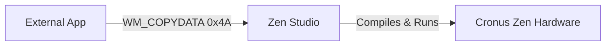

# Zen Studio Interop

External desktop applications (e.g. customized compiler helper tools, configuration UI launchers) can communicate directly with Zen Studio using the Win32 API. This page documents the integration protocol for inter-process communication.

---

## Inter-Process Messaging Protocol

Zen Studio intercepts the standard Windows `WM_COPYDATA` (0x004A) messaging signal. This enables external apps to send code blocks or triggers to Zen Studio.



### Windows Message Definition
* **Message ID**: `WM_COPYDATA = 0x4A`
* **lParam Struct**: A pointer to a standard `COPYDATASTRUCT` layout containing the commands and payload.

---

## Data Layout & Commands

The interop maps commands through the `dwData` flag of the copy structure.

### `REMOTECMD` Enums
* **`GpcTab = 1`**: Opens a new tab inside the Zen Studio Compiler containing the GPC code sent in the text payload.
* **`BuildAndRun = 2`**: Opens a new tab with the GPC code, compiles it immediately, and runs it on the connected Cronus Zen device.

### COPYDATASTRUCT Structure Layout
To match Win32 memory alignments, the marshalled structure must be formatted sequentially:

```csharp
[StructLayout(LayoutKind.Sequential)]
struct COPYDATASTRUCT {
    public REMOTECMD dwData; // Action Command ID (1 or 2)
    public int cbData;       // Length of the text payload in bytes
    public IntPtr lpData;    // Pointer to the text string in memory
}
```

---

## C# Implementation Example

Below is a complete C# program showing how to interface with Zen Studio. It searches for the active Zen Studio process, hooks into its window handle, wraps a custom GPC script string into a Win32 copy data payload, and triggers a compiler load.

```csharp
using System;
using System.Diagnostics;
using System.Runtime.InteropServices;
using System.Text;

namespace SendMsgAppSample
{
    class Program
    {
        private const int WM_COPYDATA = 0x4A;

        public enum REMOTECMD
        {
            GpcTab = 1,
            BuildAndRun = 2
        }

        [StructLayout(LayoutKind.Sequential)]
        struct COPYDATASTRUCT
        {
            public REMOTECMD dwData;
            public int cbData;
            public IntPtr lpData;
        }

        [DllImport("user32.dll", CharSet = CharSet.Auto)]
        private static extern IntPtr SendMessage(IntPtr hWnd, int Msg, IntPtr wParam, ref COPYDATASTRUCT lParam);

        static void Main(string[] args)
        {
            // 1. A GPC script to run
            string gpcScript = @"
define RAPID_FIRE_RATE = 50;
main {
    if (get_val(XB1_RT)) {
        combo_run(RapidFire);
    }
}
combo RapidFire {
    set_val(XB1_RT, 100);
    wait(RAPID_FIRE_RATE);
    set_val(XB1_RT, 0);
    wait(RAPID_FIRE_RATE);
}
";

            // 2. Find Zen Studio process
            Process[] processes = Process.GetProcessesByName("Zen Studio");
            if (processes.Length == 0)
            {
                Console.WriteLine("Error: Zen Studio is not running!");
                return;
            }

            IntPtr studioHandle = processes[0].MainWindowHandle;
            if (studioHandle == IntPtr.Zero)
            {
                Console.WriteLine("Error: Found Zen Studio but couldn't acquire window handle.");
                return;
            }

            // 3. Prepare the script text as byte buffer (Null-terminated ASCII)
            byte[] textBytes = Encoding.ASCII.GetBytes(gpcScript + "\0");
            IntPtr allocatedMemory = Marshal.AllocHGlobal(textBytes.Length);
            Marshal.Copy(textBytes, 0, allocatedMemory, textBytes.Length);

            // 4. Assemble the Win32 payload
            COPYDATASTRUCT payload = new COPYDATASTRUCT
            {
                dwData = REMOTECMD.BuildAndRun, // Compile and run on Zen instantly
                cbData = textBytes.Length,
                lpData = allocatedMemory
            };

            // 5. Send message (Blocks until Zen Studio receives it)
            Console.WriteLine("Sending GPC script to Zen Studio...");
            SendMessage(studioHandle, WM_COPYDATA, IntPtr.Zero, ref payload);

            // 6. Free unmanaged memory allocation
            Marshal.FreeHGlobal(allocatedMemory);
            Console.WriteLine("Sent successfully!");
        }
    }
}
```

---

## Security & Execution Contexts

If your SendMessage calls are failing or returning `0` without action, check the following system contexts:

1. **UAC Elevation Matching (UIPI restriction)**:
   Windows prevents processes running at lower integrity levels from sending messages to higher integrity level processes. If **Zen Studio** is running as **Administrator**, your C# interop application **must also be run as Administrator**.
2. **Handle Validation**:
   `processes[0].MainWindowHandle` can sometimes return `0` if Zen Studio is minimized to the system tray. Make sure the application is open and visible on screen.
3. **Null-Termination**:
   Always append a null terminator (`\0`) to your string payload before getting its byte length, otherwise the Zen Studio GPC compiler will read trash bytes at the end of the text.
