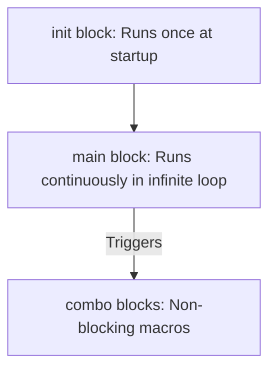

# Syntax basics

GPC is a C-based scripting language. If you have experience with C, C++, or Java, GPC syntax will feel very familiar. This page covers the basic structure of a GPC script, statements, variables, and common compiler constraints.

---

## Script Structure

A GPC script consists of up to three main code blocks: `init {}`, `main {}`, and `combo {}` blocks.



### 1. The `init` Block (Optional)
The `init` block runs exactly once when the Cronus Zen load the script (e.g. when you select the slot). Use it for resetting variables or initial settings.

```c
init {
    // Run initial logic
    set_val(XB1_RT, 0);
}
```

### 2. The `main` Block (Mandatory)
The `main` block runs inside an infinite loop. The virtual machine executes the contents of `main` continuously from top to bottom on every tick of the processor.
* The loop frequency (tick rate) matches the controller polling rate, typically every **1ms to 10ms**.
* **Do not use infinite or blocking loops (like `while` or `for` loops) inside `main`**. Blocking loops freeze the VM execution, creating massive input lag and eventually crashing the script due to watchdog timeouts.

```c
main {
    // Keep it light and fast!
    if (get_val(XB1_RT)) {
        combo_run(RapidFire);
    }
}
```

### 3. Combos (Optional)
Combos are asynchronous subroutines that handle actions requiring sequential timing. Instead of blocking the `main` loop, you launch a combo, which runs parallel to `main`, executing one step after another using `wait()` delays.

```c
combo RapidFire {
    set_val(XB1_RT, 100);
    wait(40); // Non-blocking delay: script continues running main loop
    set_val(XB1_RT, 0);
    wait(40);
}
```

---

## Syntax Rules

* **Semicolons**: Every statement must end with a semicolon `;`. Omitting a semicolon is the most common compiler error.
* **Braces**: Code blocks are enclosed in curly braces `{ }`.
* **Comments**: 
  * Single-line comments start with `//`.
  * Multi-line comments start with `/*` and end with `*/`.
* **Case Sensitivity**: GPC is case-sensitive. `myVariable` and `myvariable` are two different names. `main` must be lowercase.

---

## Data Types & Variables

GPC is a highly simplified language optimized for embedded microcontrollers. Unlike standard C, it only supports a few variables types:

### 1. Variables
Variables must be declared before they are used. You can declare them inside `main` (local scope) or at the top of the script (global scope).

* **`int`**: Declares a signed 16-bit integer. Value range: **`-32,768` to `32,767`**.
* **`char`**: Declares an 8-bit signed integer. Value range: **`-128` to `127`**.

```c
int fireRate = 40; // Global integer
char toggleState = FALSE; // Global boolean-like state

main {
    int localCounter; // Local variable
}
```


**No Floating Points!**
GPC does not support decimals (`float` or `double`). Numbers like `1.5` or `3.14` will cause compiler errors.
To work with decimals, you must use **fixed-point math** (e.g. multiply values by `10` or `100` for calculations, and divide them back down when writing outputs).


### 2. Constants (`define`)
You can define compile-time constants using the `define` keyword. Constants do not occupy memory on the device.

```c
define SENSITIVITY = 85;
define OFF = 0;
define ON = 1;
```

### 3. Const Arrays
In modern GPC scripting, `const` arrays are the preferred way to store lists of read-only values. The compiler automatically tracks the memory size for you.
* Supported array types: `int8`, `uint8`, `int16`, `uint16`, `int32`.
* Multi-dimensional arrays must have matching dimensions for all rows.

```c
// Single-dimensional array
const int8 recoil_values[] = { 10, 15, 20, 25, 30 };

// Two-dimensional array
const int8 profiles[][] = {
    { 12, 18, 0 },  // Profile 1 values
    { 20, 24, 1 }   // Profile 2 values
};

main {
    int active_recoil = recoil_values[2]; // Gets 20 (zero-based index)
}
```

### 4. Legacy Data Blocks
Older GPC scripts store lists of bytes in a static `data` block. You retrieve these values using the indexer functions `dbyte()` (unsigned byte) or `dchar()` (signed byte).
* **Syntax**: `data(<val1>, <val2>, ...);`
* Values must be unsigned bytes between `0` and `255`.
* Data blocks must be placed at the very beginning of the script.

```c
// Defined at the very top of the script
data(30, 40, 50, 60);

main {
    // Retrieves value at index 1 (which is 40)
    int value = dbyte(1);
}
```

---

## Control Flow

GPC supports standard C conditional statements:

```c
main {
    // If / Else If / Else
    if (get_val(XB1_RT) && get_val(XB1_LT)) {
        combo_run(AimAssist);
    } else if (get_val(XB1_RT)) {
        combo_run(RapidFire);
    } else {
        combo_stop(RapidFire);
    }
}
```

### Logical Operators
* `&&` : Logical AND
* `||` : Logical OR
* `!` : Logical NOT
* `==` : Equal to
* `!=` : Not equal to
* `<`, `>`, `<=`, `>=` : Comparison operators
